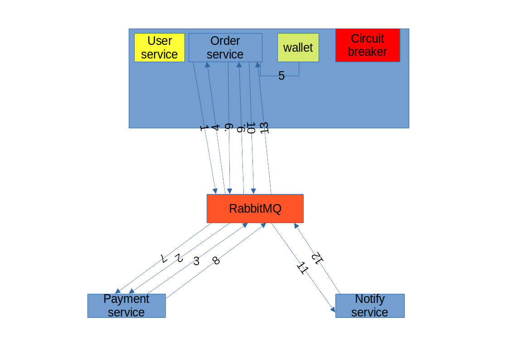

## Description of work
# current status is given in brackets for simplicity
3 applications have been added to the project:
1. order - manages orders, organizes a saga (it is better to allocate a separate service), manages a circuit breaker (usually it is used separately, and better as a proxy), requests a user's wallet (it is logical to use separately)
2. Payment - manages payment
3. Notify - manages notification

# Scheme

1. Initializing an order
2. Receiving an order Payment service, creating payment
3. Sending information to the Order service about payment
4. Receiving information to the Order service about payment
5. Requesting a sufficient amount in the wallet
6. Sending information about the sufficiency of the amount to the Payment service
7. Making a payment
8. Sending information about the payment to the Order service
9. Saving information about the payment in the Order service
10. Sending information about the payment status to the Notify service
11. Sending Email
12. Sending information about sending to the Order service
13. End of the saga

# compensating transactions are provided at each stage

# Description of the circuit breaker, to work with the queue, it listens to a separate queue, into which expired messages fall.

1. In the normal state (IsClose), messages are freely sent to the broker
2. When receiving expired messages, it goes to the Half-Open state, for delays before sending
3. After several cycles of incoming errors in the Half-Open state, it goes to the IsOpen state. Stops accepting messages and returns an error until the next startup cycle
4. If there are no errors in the IsOpen and Half-Open states, it goes to the previous state IsOpen -> Half-Open -> IsClose with each cycle.